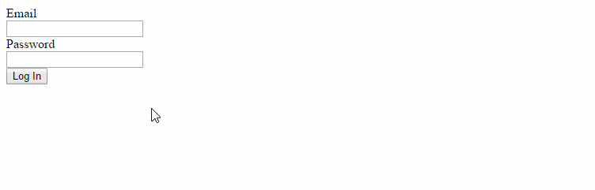

## Validating and displaying error messages on form submit ([demo](http://karaxuna.github.io/tutorial-angular-form-validation-on-submit/))

In almost all cases you want to show validation messages on form after user tries to submit it. In this
tutorial we'll create a directive that will allow us to submit form only if it is valid and show error
messages otherwise.



### Steps:
Include scripts in body tag:

```html
<!-- Angular -->
<script src="https://ajax.googleapis.com/ajax/libs/angularjs/1.4.5/angular.min.js"></script>

<!-- Prefix directive and app module -->
<script src="./index.js"></script>
```

Bootstrap `app` module:

```html
<body ng-app="app">
```

Create `app` module:

```javascript
var app = angular.module('app', []);
```

Create directive that will handle click and perform validation:

```javascript
angular.module('app').directive('validateAndSubmit', [function () {
    return {
        restrict: 'A',
        require: '^form',
        scope: {
            action: '&validateAndSubmit'
        },
        link: function (scope, element, attrs, formCtrl) {
            // ...
        }
    };
}]);
```

Explaining directive options:

`validateAndSubmit` - is the name of the directive;<br/>
`restrict: 'A'` - means that it's used as attribute on element;<br/>
`require: '^form',` - looks for parent form controller and makes it available in `link` function as 4th parameter (`formCtrl`);<br/>
`scope: { ... }` - means that directive has isolated instead of using existing one;<br/>
`action: '&validateAndSubmit'` - we are passing function that we shall call when user submits valid form;<br/>

`element` parameter in `link` function is reference of the element to which current directive is attached to. Let's 
add code to listen for element's click event:

```javascript
element.on('click', function () {
    if (formCtrl.$valid) {
        scope.action();
    }

    scope.$apply(function () {
        formCtrl.$setSubmitted(true);
    });
});
```

When user clicks on button (or on enter when filling form), we are checking if form is valid with `formCtrl.$valid` property. 
Then we set form's state as submitted. Later we will show validation messages only when form is submitted.

Directive is ready, now let's build a form:

```html
<form name="loginForm" ng-controller="loginFormCtrl" novalidate>
    ...
</form>
```

We avoid native form validation by adding `novalidate` attribute.

Create email input:

```html
<label for="email">Email</label>
<input type="email" ng-model="email" ng-required="true" name="email" id="email" />
```

`ng-model` - means that input value is bound to `scope.email` property;<br/>
`ng-required` - means that field is required;<br/>
`name` - we need name to access field by `<form_name>.<input_name>`. In this case `loginForm.email`;<br/>

And create password input:

```html
<label for="password">Password</label>
<input type="password" ng-model="password" ng-required="true" ng-minlength="5" name="password" id="password" />
```

`min-length` - means that input will be invalid if it's length is less than 5 characters;<br/>

Now add containers where validation messages will appear:

Under email input:

```html
<div ng-if="loginForm.$submitted">
    <div ng-if="loginForm.email.$error.required" class="validation-message">Email is required.</div>
    <div ng-if="loginForm.email.$error.email" class="validation-message">Email format is invalid.</div>
</div>
```

`ng-if="loginForm.$submitted"` - means that this piece of html will be generated only when form is submitted;<br/>
`loginForm.email.$error.required` - property will only exist if email is empty;<br/>
`loginForm.email.$error.email` - property will exist if email format is invalid;<br/>

Under password input:

```html
<div ng-if="loginForm.$submitted">
    <div ng-if="loginForm.password.$error.required" class="validation-message">Password is required.</div>
    <div ng-if="loginForm.password.$error.minlength" class="validation-message">Password length must be at least 5 characters.</div>
</div>
```

`loginForm.password.$error.minlength` - property will exist if password characters length is less than 5;<br/>

Form inputs are ready, let's add submit button:

```html
<button validate-and-submit="logIn()">Log In</button>
```

Clicking "Log In" button results in showing validation messages if the form is invalid, otherwise it will call 
`$scope.login` function inside login form controller (we named it `loginFormCtrl`):

```javascript
angular.module('app').controller('loginFormCtrl', ['$scope', function ($scope) {
    $scope.logIn = function () {
        alert('Valid!');
    };
}]);
```

Now let's add minimal styles for showing red colored validation messages:

```css
.ng-submitted .ng-invalid {
    border: solid 1px red;
}

.validation-message {
    color: red;
}
```

That's it!

### Running demo:
1. Clone repository: `git clone https://github.com/karaxuna/tutorial-angular-form-validation-on-submit`;
2. Open `index.html` file in browser;
